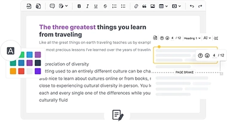
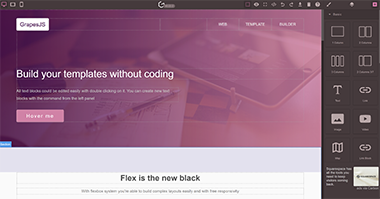
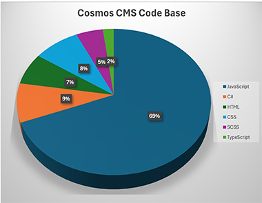

# Cosmos CMS
[Project Website](https://cosmos.moonrise.net) | [Documentation](https://cosmos.moonrise.net/Docs) | [Get Free Help](https://cosmos.moonrise.net/Support) | [YouTube Channel](https://www.youtube.com/@cosmos-cms) | [Install](https://github.com/MoonriseSoftwareCalifornia/CosmosCMS?tab=readme-ov-file#installation)

Older web content management systems like WordPress need significant modification perform well and have well known security issues.  While newer systems perform far better--they often come at a steep price, and are often difficult to use and maintain. Moreover, many are proprietary and expensive to own--and come with a steep learning curve and training budget.

Cosmos solves these problems:

* First of all, it is open source. Free to install and use.
* Next, it is cloud-native and is high performance "out of the box." No mods needed.
* Its installation and operation are a "breeze."
* No steep learning curve, or expensive expertise to develop.
* Web developers need only be skilled in general HTML, CSS and JavaScript to build websites.
* Developers can hand over content management to non-technical maintainers with little or no training.
* Cosmos comes with the best content tools on the planet: CKEditor, GrapesJS, VS Code, FileRobot.

Content creators and developers have called Cosmos "a dream to use. "Here is a look at the content tools built-in to it:

## CKEditor 5

[CKEditor](https://ckeditor.com/) is a widely-used "no-code" or [WYSIWYG](https://en.wikipedia.org/wiki/WYSIWYG) (What You See Is What You Get) HTML text editor that allows users to create and edit web content with ease, without needing to write HTML code. It is highly popular due to its robust features, including rich text formatting options, a customizable interface, and extensive documentation [1](https://trends.builtwith.com/widgets/CKEditor). CKEditor supports a wide range of plugins, enabling users to extend its functionality to meet specific needs. Its frequent updates and large community also contribute to its reliability and versatility, making it a preferred choice for developers and content creators alike [2](https://dev.to/keganblumenthal/froala-vs-ckeditor-a-duel-between-the-two-most-popular-html-editors-3igg).

## GrapesJS

[GrapesJS](https://grapesjs.com/) is a free, open-source web builder framework designed to help developers and designers create and customize web pages and HTML templates with ease. It features a visual editor with a drag-and-drop interface, allowing users to build complex web pages without needing extensive coding knowledge [3](https://esketchers.com/grapesjs-things-to-consider-before-using-it/). GrapesJS is popular due to its flexibility, extensive customization options, and a wide range of pre-designed templates and components [4](https://www.talentica.com/blogs/grapesjs-things-to-consider-before-using-it/). It was initially developed to be integrated into Content Management Systems (CMS) to speed up the creation of dynamic templates, making it a versatile tool for both beginners and experienced developers [4](https://www.talentica.com/blogs/grapesjs-things-to-consider-before-using-it/). The ability to export designs in various formats and its active community support further contribute to its widespread adoption [3](https://esketchers.com/grapesjs-things-to-consider-before-using-it/).

See our [YouTube video](https://www.youtube.com/watch?v=mVGPlbnbC5c) that shows GrapesJS at work with Cosmos.

## Monaco/Visual Studio Code

<image src="./CodeEditor.png" style="max-width: 380px;">

The [Monaco Editor](https://microsoft.github.io/monaco-editor/) is a powerful, open-source code editor that powers Visual Studio Code, Microsoft's popular code editor. It is designed to provide a rich editing experience with features like syntax highlighting, IntelliSense, and code navigation [5](https://snyk.io/advisor/python/monaco-editor). Monaco Editor is highly popular due to its versatility and performance, supporting a wide range of programming languages and being easily embeddable in web applications [6](https://npm-compare.com/codemirror,monaco-editor). Its robust API allows developers to customize and extend its functionality to suit specific needs, making it a preferred choice for many web-based development tools [6](https://npm-compare.com/codemirror,monaco-editor). The active community and continuous updates further enhance its reliability and appeal [5](https://snyk.io/advisor/python/monaco-editor).

Our implementation of Monaco includes a DIFF tool and Emmet Notation.

## Filerobot Image Editor

<image src="./Filerobot.png" style="max-width: 380px;">

[Filerobot](https://scaleflex.github.io/filerobot-image-editor/) Image Editor is a versatile, easy-to-use image editing tool designed to be seamlessly integrated into web applications. It allows users to perform a variety of image transformations such as resizing, cropping, flipping, fine-tuning, annotating, and applying filters with just a few lines of code [7](https://github.com/scaleflex/filerobot-image-editor). Its popularity stems from its simplicity, extensive functionality, and the ability to enhance user experience by providing powerful editing capabilities directly within web platforms [7](https://github.com/scaleflex/filerobot-image-editor). Additionally, its open-source nature and active maintenance ensure it remains up-to-date and reliable for developers [8](https://socket.dev/npm/package/filerobot-image-editor).

## Filepond File Uploader

[FilePond](https://pqina.nl/filepond/) is a versatile file upload library designed for web applications, offering a sleek and customizable interface for handling file uploads. It supports features like image previews, drag-and-drop functionality, and file validation, making it user-friendly and efficient [9](https://npm-compare.com/filepond). FilePond's popularity stems from its ease of integration, extensive customization options, and the ability to handle various file types seamlessly [9](https://npm-compare.com/filepond). Its active community and continuous updates ensure it remains a reliable and up-to-date solution for developers looking to enhance their web applications with robust file upload capabilities [9](https://npm-compare.com/filepond).

## Cosmos CMS Architecture

Cosmos is a **decoupled web content management system (CMS)**. This separates the content creation and management from the presentation layer. In this setup, the backend (where content is created and managed) is independent of the frontend (where content is displayed). This allows content to be delivered to various platforms, such as websites, mobile apps, and IoT devices, through APIs, without being tied to a specific presentation framework.

The benefits of a decoupled CMS include greater flexibility and scalability. Since the backend and frontend are independent, developers can use different technologies for each, optimizing performance and user experience. It also allows for faster updates and easier maintenance, as changes in one layer do not directly affect the other. Additionally, content can be reused across multiple channels, enhancing consistency and efficiency in content delivery.

### The Editor App

Content is created an managed using the "Editor," which includes the content editing tools menstioned above. The source code for the editor can be found in the [Editor](https://github.com/MoonriseSoftwareCalifornia/CosmosCMS/tree/main/Editor) folder of this repository.

### The Publisher

Your website and content is hosted by the [Publisher](https://github.com/MoonriseSoftwareCalifornia/CosmosCMS/tree/main/Publisher) web application. It is designed to be extremely fast. This is accomplished through keeping the code base lean and uncomplicated.

### NoSQL Database - Cosmos DB

Cosmos CMS uses **Azure Cosmos DB**, which is a fully managed, globally distributed NoSQL and relational database service provided by Microsoft. It is designed to offer high availability, low latency, and seamless scalability for modern applications. Azure Cosmos DB supports multiple data models, including document, key-value, graph, and column-family, and provides APIs for popular databases like MongoDB, Cassandra, and Gremlin [10](https://learn.microsoft.com/en-us/azure/cosmos-db/) [11](https://learn.microsoft.com/en-us/azure/cosmos-db/introduction).

We built Cosmos CMS upon this database to leverage its high availability, low latency, and global distribution capabilities. Cosmos DB's ability to handle diverse data models and provide seamless scalability ensures that the CMS can efficiently manage and deliver content to users worldwide. Its multi-region data distribution feature allows for fast, localized access to content, enhancing user experience. Additionally, Cosmos DB's robust security and enterprise-grade SLAs ensure that the CMS remains reliable and secure, even under heavy traffic and complex workloads.

### Blob Storage and Static Website

Cosmos stores static assets uploaded as content to the website in a **blob storage** with a **static website**. This is key to how Cosmos can perform so well. Hosting website assets this way offers several benefits:

* Using blob storage with a static website significantly improves performance, as content is served directly from the storage, reducing server load and latency.
* Additionally, blob storage provides a cost-effective and scalable solution for storing large amounts of unstructured data, such as images, videos, and documents.
* It ensures high availability and durability, meaning your assets are always accessible and protected against data loss.
* This setup also simplifies deployment and maintenance, as there is no need for server-side processing, making it easier to manage and update your website.

## Code Base

If you are a JavaScript developer you should feel right at home with Cosmos.  The bulk of the code (69%) is from CKEditor, GrapesJS, Monaco, Filerobot, and Filepond--all of which are JavaScript based. Back-end logic is written in ASP.NET Core (C#), and that accounts for only 9%. What remains is CSS, HTML, SCSS and TypeScript.

Most of what makes up Cosmos is NPM and NuGet package-based.

## Docker Containers

Both the Editor and Publisher are deployed as Docker containers.  Each can be found on Docker Hub:

* [Editor Docker Container](https://hub.docker.com/r/toiyabe/cosmos-editor)
* [Publisher Docker Container](https://hub.docker.com/r/toiyabe/cosmos-publisher)

## Installation

Cosmos and all its components are installed using Azure Resource Manager (ARM) templates.  The source code for these templates are located in the [ArmTemplates](https://github.com/MoonriseSoftwareCalifornia/CosmosCMS/tree/main/ArmTemplates/Installation) folder of this repository.

Here is a [YouTube video](https://www.youtube.com/watch?v=KUC58_6mH24&t=47s) that shows how the install works.

Here is a listing of each template with a deployment link:

* Install without EMail service integration.  This is a good option if you would like to quickly try Cosmos. EMail integration can be added later. [[View Source]](https://github.com/MoonriseSoftwareCalifornia/CosmosCMS/blob/main/ArmTemplates/Installation/azuredeploy-no-email.json) [[Run Script]](https://portal.azure.com/#create/Microsoft.Template/uri/https%3A%2F%2Fraw.githubusercontent.com%2FMoonriseSoftwareCalifornia%2FCosmosCMS%2Frefs%2Fheads%2Fmain%2FArmTemplates%2FInstallation%2Fazuredeploy-no-email.json "Clicking here will use this script to deploy Cosmos with this option.")
* Install with [Azure Communication Services (with Email)](https://learn.microsoft.com/en-us/azure/communication-services/quickstarts/email/send-email?tabs=windows%2Cconnection-string%2Csend-email-and-get-status-async%2Csync-client&pivots=platform-azportal) integration. [[View Source]](https://github.com/MoonriseSoftwareCalifornia/CosmosCMS/blob/main/ArmTemplates/Installation/azuredeploy-azurecomm.json) [[Run Script]](https://portal.azure.com/#create/Microsoft.Template/uri/https%3A%2F%2Fraw.githubusercontent.com%2FMoonriseSoftwareCalifornia%2FCosmosCMS%2Frefs%2Fheads%2Fmain%2FArmTemplates%2FInstallation%2Fazuredeploy-azurecomm.json "Clicking here will use this script to deploy Cosmos with this option.")
* Install with [Twillio SendGrid](https://sendgrid.com/en-us/partners/azure) integration. [[View Source]](https://github.com/MoonriseSoftwareCalifornia/CosmosCMS/blob/main/ArmTemplates/Installation/azuredeploy-sendgrid.json) [[Run Script]](https://portal.azure.com/#create/Microsoft.Template/uri/https%3A%2F%2Fraw.githubusercontent.com%2FMoonriseSoftwareCalifornia%2FCosmosCMS%2Frefs%2Fheads%2Fmain%2FArmTemplates%2FInstallation%2Fazuredeploy-sendgrid.json "Clicking here will use this script to deploy Cosmos with this option.")
* Install to work with any SMTP service. [[View Source]](https://github.com/MoonriseSoftwareCalifornia/CosmosCMS/blob/main/ArmTemplates/Installation/azuredeploy-smtp.json) [[Run Script]](https://portal.azure.com/#create/Microsoft.Template/uri/https%3A%2F%2Fraw.githubusercontent.com%2FMoonriseSoftwareCalifornia%2FCosmosCMS%2Frefs%2Fheads%2Fmain%2FArmTemplates%2FInstallation%2Fazuredeploy-smtp.json "Clicking here will use this script to deploy Cosmos with this option.")
